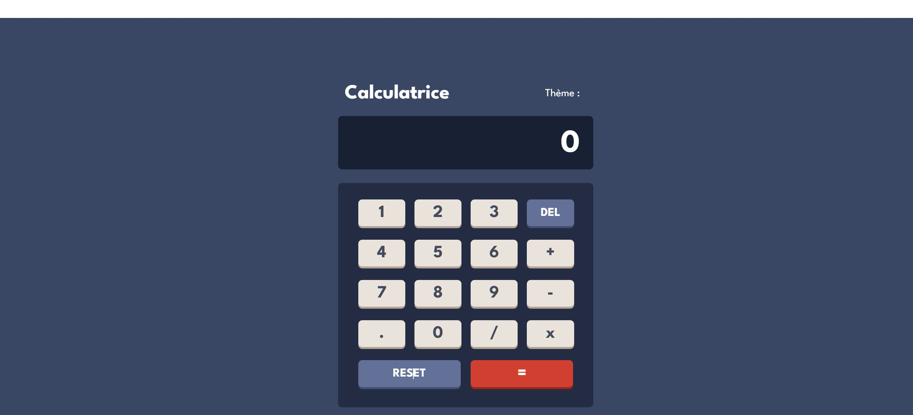
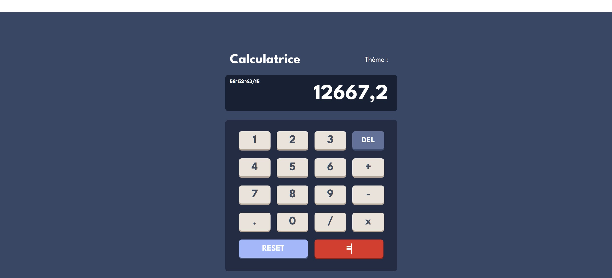

# Frontend Mentor - Calculator app solution

This is a solution to the [Calculator app challenge on Frontend Mentor](https://www.frontendmentor.io/challenges/calculator-app-9lteq5N29). Frontend Mentor challenges help you improve your coding skills by building realistic projects.

### Links

- Solution URL: [Github](https://github.com/SdevWeb7/Calculator)
- Live Site URL: [Github Pages](https://sdevweb7.github.io/Calculator)

### Built with

- Semantic HTML5 markup
- CSS custom properties
- CSS Grid
- [React](https://reactjs.org/) - JS library
- [Vite.js](https://vitejs.dev/guide/) - Vite

## Author

- Website - [SdevWeb](https://sdevweb.com)
- Frontend Mentor - [@yourusername](https://www.frontendmentor.io/profile/yourusername)
- Github - [SdebWeb7](https://github.com/SdevWeb7)
